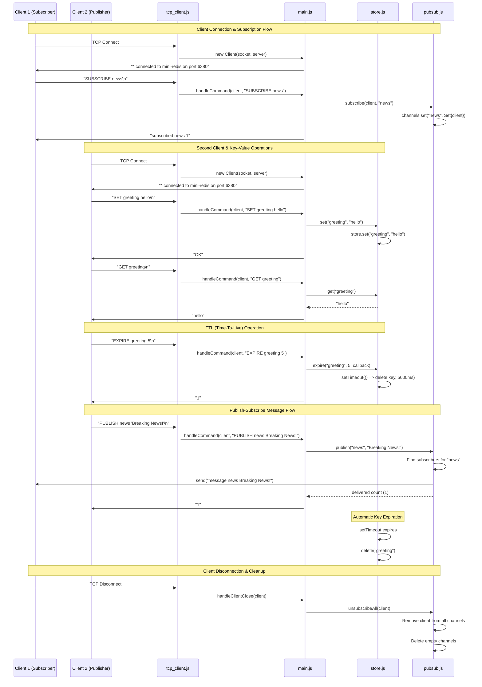

# Mini Redis Clone

A lightweight Redis-like server implementation built with Node.js core modules. This project provides essential Redis functionality including key-value storage with TTL support and publish-subscribe messaging, all accessible via a simple TCP protocol.

## 🚀 Project Overview

This Mini Redis Clone implements a subset of Redis functionality using only Node.js built-in modules. It supports:

- **Key-Value Operations**: Store, retrieve, and delete string values with optional expiration
- **Time-To-Live (TTL)**: Automatic key expiration using JavaScript timers
- **Publish-Subscribe**: Real-time message broadcasting between clients
- **Multi-Client Support**: Concurrent TCP connections with proper connection management
- **Protocol Compatibility**: Simple line-based protocol similar to Redis

## 🏗️ Architecture

The codebase is organized into four main modules, each with distinct responsibilities:

### `main.js` - Main Server Implementation

- **Purpose**: Core server orchestration and command routing
- **Responsibilities**:
  - TCP server setup and client connection handling
  - Command parsing with support for quoted arguments and escaped characters
  - Command dispatch to appropriate handlers (key-value or pub-sub operations)
  - Error handling and response formatting
  - Server lifecycle management (start/stop)

### `store.js` - In-Memory Key-Value Store

- **Purpose**: Data storage and retrieval with TTL support
- **Responsibilities**:
  - Key-value storage using JavaScript Map
  - TTL implementation using setTimeout for automatic expiration
  - CRUD operations: SET, GET, DEL with proper cleanup
  - Expiration callback support for custom cleanup logic

### `pubsub.js` - Publish-Subscribe Message Broker

- **Purpose**: Real-time message distribution between clients
- **Responsibilities**:
  - Channel subscription management using Map<channel, Set<clients>>
  - Message broadcasting to all subscribers of a channel
  - Automatic cleanup of empty channels
  - Client unsubscription handling (individual and bulk)

### `tcp_client.js` - TCP Client Connection Management

- **Purpose**: Individual client connection lifecycle and communication
- **Responsibilities**:
  - TCP socket management with proper encoding (UTF-8)
  - Line-buffered command processing (handles partial receives)
  - Client state tracking (subscriptions, unique ID)
  - Connection cleanup and graceful error handling

## 📋 Supported Commands

### Connection Commands

#### `PING`

- **Description**: Test server connectivity
- **Syntax**: `PING`
- **Response**: `PONG`
- **Example**:
  ```
  > PING
  < PONG
  ```

### Key-Value Commands

#### `SET key value`

- **Description**: Store a string value for the given key
- **Syntax**: `SET key value`
- **Response**: `OK` on success
- **Notes**: Value can contain spaces if wrapped in double quotes
- **Example**:
  ```
  > SET greeting "hello world"
  < OK
  > SET counter 42
  < OK
  ```

#### `GET key`

- **Description**: Retrieve the value of a key
- **Syntax**: `GET key`
- **Response**: The value or `(nil)` if key doesn't exist
- **Example**:
  ```
  > GET greeting
  < hello world
  > GET nonexistent
  < (nil)
  ```

#### `DEL key [key ...]`

- **Description**: Delete one or more keys
- **Syntax**: `DEL key1 [key2 key3 ...]`
- **Response**: Number of keys that were deleted
- **Example**:
  ```
  > DEL greeting counter
  < 2
  > DEL nonexistent
  < 0
  ```

#### `EXPIRE key seconds`

- **Description**: Set a timeout on a key (TTL - Time To Live)
- **Syntax**: `EXPIRE key seconds`
- **Response**: `1` if timeout was set, `0` if key doesn't exist
- **Notes**: Key will be automatically deleted after the specified seconds
- **Example**:
  ```
  > SET temp_data "will expire"
  < OK
  > EXPIRE temp_data 10
  < 1
  # After 10 seconds, temp_data will be automatically deleted
  ```

### Publish-Subscribe Commands

#### `SUBSCRIBE channel [channel ...]`

- **Description**: Subscribe to one or more channels to receive published messages
- **Syntax**: `SUBSCRIBE channel1 [channel2 channel3 ...]`
- **Response**: `subscribed <channel> <total_subscriptions>` for each channel
- **Notes**: Client enters subscriber mode and will receive messages from subscribed channels
- **Example**:
  ```
  > SUBSCRIBE news sports
  < subscribed news 1
  < subscribed sports 2
  ```

#### `UNSUBSCRIBE [channel ...]`

- **Description**: Unsubscribe from channels
- **Syntax**: `UNSUBSCRIBE [channel1 channel2 ...]`
- **Response**: `unsubscribed <channel> <remaining_subscriptions>` for each channel
- **Notes**: If no channels specified, unsubscribes from all channels
- **Example**:
  ```
  > UNSUBSCRIBE news
  < unsubscribed news 1
  > UNSUBSCRIBE
  < unsubscribed sports 0
  ```

#### `PUBLISH channel message`

- **Description**: Send a message to all subscribers of a channel
- **Syntax**: `PUBLISH channel message`
- **Response**: Number of clients that received the message
- **Notes**: Message can contain spaces if wrapped in double quotes
- **Example**:
  ```
  > PUBLISH news "Breaking: Node.js is awesome!"
  < 3
  ```

#### Message Delivery Format

When a message is published to a subscribed channel, subscribers receive:

```
message <channel> <message_content>
```

**Example**:

```
< message news Breaking: Node.js is awesome!
```

## 🚀 Usage Instructions

### Starting the Server

1. **Default Configuration** (Port 6380):

   ```bash
   node main.js
   ```

2. **Custom Port** using environment variable:

   ```bash
   PORT=7000 node main.js
   ```

3. **Built-in Demo Mode**:
   ```bash
   node main.js --demo
   ```
   This starts the server and runs an automated demo showcasing key features.

### Connecting Clients

You can connect to the server using any TCP client. Here are some common methods:

#### Using netcat (nc)

```bash
nc 127.0.0.1 6380
```

#### Using telnet

```bash
telnet 127.0.0.1 6380
```

#### Using Node.js net module

```javascript
const net = require("net");
const client = net.connect(6380, "127.0.0.1", () => {
  console.log("Connected to mini-redis");
  client.write("PING\n");
});
client.on("data", (data) => console.log("Server:", data.toString()));
```

### Protocol Notes

- **Line Termination**: Each command must end with `\n` or `\r\n`
- **Argument Separation**: Use spaces to separate command arguments
- **Quoted Arguments**: Wrap arguments containing spaces in double quotes (`"`)
- **Escaping**: Use backslash (`\`) to escape quotes within quoted strings
- **Case Sensitivity**: Commands are case-insensitive, but keys/channels/messages are case-sensitive

### Example Session

Here's a complete example showing key-value operations and pub-sub:

```bash
# Terminal 1 - Subscriber
$ nc 127.0.0.1 6380
* connected to mini-redis on port 6380
SUBSCRIBE news alerts
subscribed news 1
subscribed alerts 2
# Wait for messages...
message news Breaking: Server is running!
message alerts System maintenance in 1 hour

# Terminal 2 - Publisher & Key-Value Operations
$ nc 127.0.0.1 6380
* connected to mini-redis on port 6380
SET user:1 "John Doe"
OK
GET user:1
John Doe
EXPIRE user:1 30
1
PUBLISH news "Breaking: Server is running!"
1
PUBLISH alerts "System maintenance in 1 hour"
1
DEL user:1
1
```

## 📊 Component Interaction Flow

The following sequence diagram illustrates how the different components interact during typical operations:



### Key Interaction Patterns

1. **Client Connection**: TCP clients connect through `tcp_client.js`, which creates a `Client` instance and registers event handlers
2. **Command Processing**: All commands flow through `main.js` which parses and routes them to appropriate modules
3. **Key-Value Operations**: Storage operations are handled by `store.js` with automatic TTL management
4. **Pub-Sub Messaging**: `pubsub.js` manages channel subscriptions and message broadcasting
5. **Cleanup**: Client disconnections trigger automatic cleanup of subscriptions and resources

## 🛠️ Technical Details

### Dependencies

- **Node.js Built-in Modules Only**: No external dependencies required
  - `net` - TCP server and client functionality
  - `crypto` - UUID generation for client identification

### Performance Characteristics

- **Memory Usage**: All data stored in JavaScript Maps (in-memory only)
- **Concurrency**: Single-threaded with event-driven I/O
- **TTL Implementation**: Uses JavaScript `setTimeout` for key expiration
- **Connection Handling**: Each client maintains its own buffer for partial message handling

### Limitations

- **Persistence**: No data persistence - all data lost on server restart
- **Clustering**: Single-process only, no clustering support
- **Authentication**: No authentication or authorization mechanisms
- **Protocol**: Simplified protocol, not fully Redis-compatible
- **Data Types**: String values only (no lists, sets, hashes, etc.)

## 🧪 Testing

To test the server functionality:

1. **Start the server**:

   ```bash
   node main.js
   ```

2. **Run basic connectivity test**:

   ```bash
   echo "PING" | nc 127.0.0.1 6380
   # Expected output: PONG
   ```

3. **Test key-value operations**:

   ```bash
   (echo "SET test hello"; echo "GET test"; echo "DEL test") | nc 127.0.0.1 6380
   ```

4. **Test pub-sub** (requires multiple terminals):

   ```bash
   # Terminal 1 (subscriber)
   echo "SUBSCRIBE test_channel" | nc 127.0.0.1 6380

   # Terminal 2 (publisher)
   echo "PUBLISH test_channel 'Hello World'" | nc 127.0.0.1 6380
   ```

## 📝 License

This project is provided as-is for educational purposes. Feel free to use, modify, and distribute according to your needs.

## 🤝 Contributing

This is a learning project demonstrating Redis-like functionality. Contributions, suggestions, and improvements are welcome!

### Potential Enhancements

- Add support for more Redis data types (lists, sets, hashes)
- Implement Redis Serialization Protocol (RESP)
- Add configuration file support
- Implement basic authentication
- Add logging and monitoring capabilities
- Create comprehensive test suite
